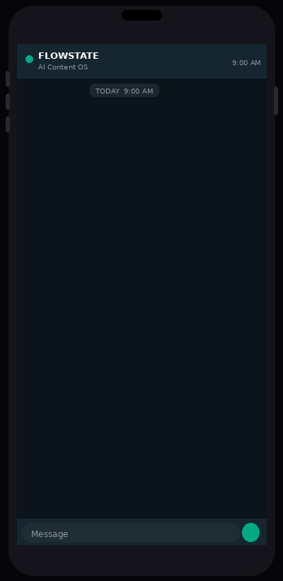
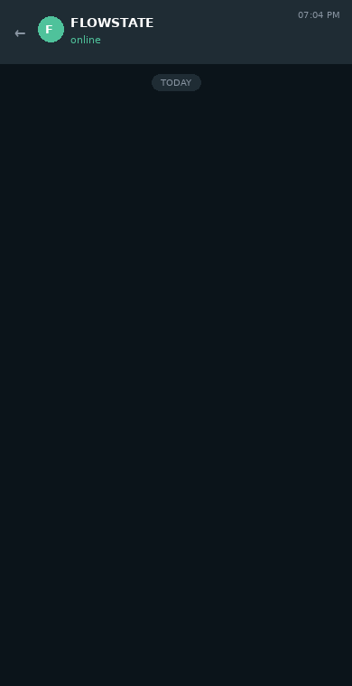

# FLOWSTATE

> Drop content. It tags it, tracks it, finds trends, writes captions, suggests reels, and posts. You say yes from WhatsApp.

FLOWSTATE is a self-hosted AI content operating system. It manages your entire content operation end-to-end — library intelligence, trend research, caption writing, reel creation, and cross-platform posting. Your only interface is WhatsApp.

No apps to open. No captions to write. No deciding what to post. No scheduling.

**Built and tested by [Sanyuja Desai](https://www.linkedin.com/in/sanyujadesai) across 3 distinct content personas.**

---

### Every morning at 9am — without you doing anything



*The Trend Scout researches what's trending in your niches, finds the best unposted match in your library, writes 3 captions in your voice, and sends them to your WhatsApp. You reply Y1, Y2, or Y3. Done.*

---

### Or drop any file for an instant approval



*Drop a file into your content folder. n8n detects it, GPT-4o analyses it, 3 captions arrive on WhatsApp in about 30 seconds. Reply to post.*

---

## How the full system works

FLOWSTATE runs two loops.

**Loop 1 — Content library** *(run once a week, or after a content drop)*

```
┌─────────────────────────────────────────────────────────┐
│  You drop files into your content folder                │
└───────────────────────┬─────────────────────────────────┘
                        ↓
┌─────────────────────────────────────────────────────────┐
│  CLIP ViT-L-14 classifies every file  (local, free)     │
│  → vibe · outfit · activity · location · platform fit   │
└───────────────────────┬─────────────────────────────────┘
                        ↓
┌─────────────────────────────────────────────────────────┐
│  Claude Haiku Vision enriches top images                │
│  → richer labels · per-platform captions in your voice  │
└───────────────────────┬─────────────────────────────────┘
                        ↓
┌─────────────────────────────────────────────────────────┐
│  Database records every file                            │
│  → filename · tags · captions · platform fit · posted   │
└───────────────────────┬─────────────────────────────────┘
                        ↓
┌─────────────────────────────────────────────────────────┐
│  Files move to categorised folders                      │
│  dance/ · lifestyle/ · coffee/ · fits/ · _VAULT/        │
└─────────────────────────────────────────────────────────┘
```

**Loop 2 — Daily intelligence** *(runs at 9am automatically)*

```
┌─────────────────────────────────────────────────────────┐
│  AI researches trending hashtags + themes               │
│  for your content niches (from persona.json)            │
└───────────────────────┬─────────────────────────────────┘
                        ↓
┌─────────────────────────────────────────────────────────┐
│  Scans your unposted library                            │
│  → scores each file against today's trends              │
│  → picks the best match                                 │
└───────────────────────┬─────────────────────────────────┘
                        ↓
┌─────────────────────────────────────────────────────────┐
│  Generates 3 trend-aware captions in your brand voice   │
└───────────────────────┬─────────────────────────────────┘
                        ↓
┌─────────────────────────────────────────────────────────┐
│  WhatsApp nudge:                                        │
│  📈 Trending: #quietluxury #slowliving                  │
│  Best match: coffee/IMG_0234.jpg                        │
│  Y1: "morning ritual."                                  │
│  Y2: "the quiet before everything."                     │
│  Y3: "soft start."                                      │
└───────────────────────┬─────────────────────────────────┘
                        ↓
        You reply Y1 / Y2 / Y3  ←  takes 5 seconds
                        ↓
┌─────────────────────────────────────────────────────────┐
│  Posts to Instagram · Threads · X (manual)              │
│  Database marks it posted — won't repeat until reuse    │
└─────────────────────────────────────────────────────────┘
```

---

## Your brand brain — persona.json

Everything lives in one file: `config/persona.json`. This is the only config you touch.

```json
{
  "persona": {
    "name": "your_handle",
    "display_name": "Your Display Name",
    "niches": "lifestyle, fitness, coffee culture",
    "voice_brief": "Minimal, understated. Short sentences. Never hashtag-spam. Reads like a thought, not a caption. Audience: 25-35 women who value aesthetic calm."
  },
  "platforms": {
    "instagram": true,
    "threads": true,
    "x_manual": true
  },
  "content_folders": {
    "dance":     { "blur": "aggressive" },
    "fits":      { "blur": "moderate"  },
    "lifestyle": { "blur": "light"     },
    "coffee":    { "blur": "none"      },
    "nsfw":      { "vault_only": true  }
  },
  "caption_style": {
    "hashtags_in_first_comment": true,
    "hashtags_per_post": 7
  }
}
```

- `voice_brief` — the AI reads this when writing every caption, trend suggestion, and reel concept. The more specific it is, the better the output.
- `niches` — drives daily trend research. The AI focuses on hashtags and themes actually relevant to your content.
- `content_folders` — defines blur rules and vault routing per category. Sensitive content routes to `_VAULT` and never leaves your machine.

See [config/persona.example.json](config/persona.example.json) for the full annotated template.

---

## Everything you do from WhatsApp

WhatsApp is your only interface. You never need to open Instagram, a scheduler, or a caption tool.

| You send | What happens |
|---|---|
| *(nothing)* | At 9am: AI picks the best unposted content, writes 3 trend-matched captions, sends a nudge |
| `Y1` / `Y2` / `Y3` | Posts that caption to all platforms for your persona |
| `N` | Skips. Item stays in library as unposted. |
| `IDEA: dance, moody red light, 20s VO` | AI scores your clips, picks best match, generates voiceover, assembles reel, sends you a preview link |
| `IDEA: lifestyle, golden hour, 30s no VO` | Same without voiceover |
| `POST` *(after reel preview)* | Posts the reel |
| `REDO` | Reassembles with different clips |
| `SKIP` | Discards |

---

## Content library and database

Every file you drop gets classified and recorded. Nothing falls through the cracks.

**What gets stored per file:**

| Field | Example |
|---|---|
| Filename | `IMG_0234.jpg` |
| Category folder | `coffee` |
| Vibe | `quiet luxury, minimal` |
| Activity | `drinking coffee, reading` |
| Style | `moody, editorial` |
| Platform fit | safe-for-work |
| Generated hashtags | `#quietluxury #slowmorning #morningritual` |
| IG-eligible | yes |
| Posted | no |
| Posted date | — |

The master database lives in `master_content_db.xlsx` (Dashboard, full library, platform routing, and captions sheets) and is also exported as `content_inventory.json` for the daily Trend Scout to query.

**Content reuse:** Once a piece of content is posted, the DB records when. The Trend Scout skips recently-posted content by default. After a cooldown period — or if a trend resurges — it can surface the same file again with a fresh caption tuned to today's context. Evergreen content gets more mileage without repeating itself.

---

## Reel creation

**You request it:**

Send from WhatsApp:
```
IDEA: [content type], [mood], [duration]s [VO or no VO]
```

Examples:
- `IDEA: dance, moody red light, 20s VO`
- `IDEA: lifestyle, golden hour, 30s no VO`
- `IDEA: fitness, energetic, 15s VO`

The system:
1. Scores every clip in your DB against the mood
2. Selects the best clips
3. Generates a voiceover script + audio (if requested) via OpenAI TTS
4. Assembles via FFmpeg — 9:16 crop, xfade transitions, voiceover mix, caption burn-in
5. Uploads to Imgur, sends you a preview link
6. You reply `POST`, `REDO`, or `SKIP`

Available styles: `smooth` · `energetic` · `slow_burn` · `dramatic`

**AI-suggested groupings** *(coming)*: When the Trend Scout scans your library it will flag when several unposted clips share a vibe or mood — "these 4 clips look like a reel" — and suggest a song direction alongside the option to assemble. Same `Y`/`N` approval flow.

See [docs/reel-creator.md](docs/reel-creator.md) for the full guide.

---

## Tech stack

| Layer | Tool | Cost |
|---|---|---|
| Automation brain | n8n (self-hosted) | Free |
| Content classification | OpenCLIP ViT-L-14 (local) | Free |
| AI vision + captions | GPT-4o + Claude Haiku | ~$0.003-0.05/image |
| Trend research | GPT-4o | ~$0.02/day |
| AI voiceover | OpenAI TTS | ~$0.015/1k chars |
| Image processing | Sharp.js | Free |
| Video assembly | FFmpeg + Python | Free |
| Image hosting | Imgur API | Free |
| Post to Instagram | Instagram Graph API | Free |
| Post to Threads | Threads API | Free |
| WhatsApp bot | Twilio | ~$0.005/message |
| Webhook tunnel | ngrok | Free tier |

**Total running cost: roughly $5-20/month** depending on how much content you push through.

---

## Repo structure

```
flowstate/
├── workflows/                         <- Import these into n8n
│   ├── image_pipeline.json            <- Folder watcher → blur → captions → WhatsApp
│   ├── approval_handler.json          <- Receives Y1/Y2/Y3 → posts to platforms
│   ├── reel_creator.json              <- WhatsApp IDEA → assembles reel → preview
│   └── trend_scout.json               <- Daily 9am: trends + inventory → WhatsApp nudge
│
├── scripts/                           <- Run locally to build and maintain your library
│   ├── blur.js                        <- Node.js: GPT-4o Vision + Sharp blur
│   ├── reel_creator.py                <- Python: FFmpeg reel assembly pipeline
│   ├── content_tagger.py              <- CLIP ViT-L-14: auto-tags every file
│   ├── content_refiner.py             <- Claude Haiku Vision: enriches labels + writes captions
│   ├── content_organizer.py           <- Moves raw files into categorised folders
│   └── content_db_updater.py          <- Builds master_content_db.xlsx + content_inventory.json
│
├── config/
│   └── persona.example.json           <- Your persona definition — start here
│
├── setup/
│   ├── setup.ps1                      <- One-time Windows setup (run as Admin)
│   └── install_reel_deps.ps1          <- Install FFmpeg + Python deps
│
├── docs/
│   ├── how-it-works.md                <- Full system architecture
│   ├── persona-setup.md               <- Configuring your persona and folders
│   ├── credentials-setup.md           <- Getting every API key, step by step
│   ├── reel-creator.md                <- Using the reel creator
│   └── content-intelligence.md        <- Content library + Trend Scout guide
│
├── .env.example                       <- All environment variables you need
├── requirements.txt                   <- Python dependencies
└── CONTRIBUTING.md
```

---

## Quick start

### Prerequisites

- Windows PC (always-on preferred)
- Node.js 20+
- Python 3.10+
- n8n: `npm install -g n8n`
- PM2: `npm install -g pm2`

### 1. Run the setup script

```powershell
# Run PowerShell as Administrator
cd flowstate
.\setup\setup.ps1
.\setup\install_reel_deps.ps1
```

### 2. Set your credentials

Copy `.env.example` and follow [docs/credentials-setup.md](docs/credentials-setup.md) to get each API key.

```powershell
[System.Environment]::SetEnvironmentVariable("OPENAI_API_KEY", "sk-...", "Machine")
[System.Environment]::SetEnvironmentVariable("ANTHROPIC_API_KEY", "sk-ant-...", "Machine")
[System.Environment]::SetEnvironmentVariable("TWILIO_ACCOUNT_SID", "AC...", "Machine")
# ... full list in docs/credentials-setup.md
pm2 restart n8n
```

### 3. Configure your persona

Copy `config/persona.example.json` → `config/persona.json`. Fill in your `voice_brief`, `niches`, platforms, and content folder rules. This is the only file you configure. See [docs/persona-setup.md](docs/persona-setup.md).

### 4. Build your content library

Point `CONTENT_BASE` at your content folder and run the pipeline once:

```powershell
python scripts/content_tagger.py       # tags everything (first run downloads ~800MB CLIP model)
python scripts/content_refiner.py      # enriches top images + writes captions
python scripts/content_organizer.py --dry-run  # preview the folder moves, then run live
python scripts/content_db_updater.py   # builds master DB + content_inventory.json
```

### 5. Import n8n workflows

1. Start n8n: `pm2 start n8n`
2. Open `http://localhost:5678`
3. Import all four workflows from `workflows/`
4. In each workflow, update the folder path (marked `CONFIGURE THIS`)
5. Activate all workflows

### 6. Test it

Drop an image into your content folder. Wait 30 seconds. A WhatsApp approval message should arrive.

---

## Multiple personas

To run a second persona, import the workflows again as a separate set in n8n. Each persona gets its own:

- Content folder
- `persona.json`
- n8n workflow set (completely isolated — never interacts with other personas)
- Platform targets and blur rules

They share the same n8n server, Twilio number, and API keys.

---

## A real example

FLOWSTATE is what I built for my own content operation. Three completely separate personas running off one system on a home Windows PC:

| Persona | Platforms | Content type |
|---|---|---|
| Personal lifestyle | Instagram | Coffee, home, everyday life |
| Bold lifestyle / pole dance | Instagram + Threads | Fitness, aesthetic, sensual lifestyle |
| VR gaming | Twitch + Instagram + YouTube | Gaming clips, stream highlights |

Each is completely isolated — different voice, different rules, different platforms. The system handles all caption writing, posting, and reel creation. I have not written a caption manually or opened Instagram to post since setting this up.

---

## Known limitations

**X/Twitter:** The write API costs $100/month minimum. When you approve a post, the WhatsApp confirmation includes the caption for manual paste into X.

**ngrok:** Free tier URLs reset on restart. Sign up for a free ngrok account to get one persistent static domain.

**Instagram + Threads tokens:** Expire every 60 days. Set a calendar reminder at day 50 to refresh. Commands are in [docs/credentials-setup.md](docs/credentials-setup.md).

**Windows only (currently):** Setup scripts are `.ps1`. n8n itself runs anywhere — Linux/Mac users can adapt the folder paths and skip the setup scripts.

**Trend research is not real-time:** The Trend Scout uses GPT-4o's training knowledge, which is directionally accurate but not live. Upgrade to the Perplexity API or a RapidAPI hashtag endpoint for real-time trends. See [docs/content-intelligence.md](docs/content-intelligence.md).

---

## Contributing

See [CONTRIBUTING.md](CONTRIBUTING.md). The most useful contributions are persona config examples for different creator types — fitness, gaming, lifestyle, business, etc.

---

## About

Built by [Sanyuja Desai](https://www.linkedin.com/in/sanyujadesai) — AI consultant and automation builder.

I built this because I was drowning in the admin of being a multi-platform creator. The system now runs my entire content operation in the background.

- LinkedIn: [sanyujadesai](https://www.linkedin.com/in/sanyujadesai)
- Medium: [@sanyujadesai](https://medium.com/@sanyujadesai)

---

## License

MIT — free to use, remix, and build on.
